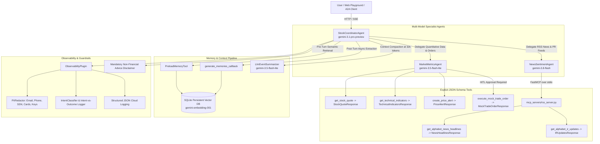

# my-agent-l200: Alphabet (Google) Stock & News Intelligence Agent

[](https://www.python.org/downloads/)
[](https://github.com/google/adk-python)
[](https://modelcontextprotocol.io)
[](https://opensource.org/licenses/Apache-2.0)

An enterprise-grade, autonomous financial intelligence agent built with the **Google Agent Development Kit (ADK)** and `agents-cli`.

It provides real-time market data, technical indicators, parsed RSS news sentiment, and simulated paper-trading execution specifically for **Alphabet Inc.** (tickers: `GOOG`, `GOOGL`).

---

## Architecture Overview



---

## Core Engineering Innovations

### 1. Strategic Multi-Model Routing
Rather than using a single model across all tasks, `my-agent-l200` strategically deploys specialized Gemini models optimized for reasoning tier, latency, and cost:

| Component | Model | Rationale |
| :--- | :--- | :--- |
| **Root Coordinator (`StockCoordinatorAgent`)** | `gemini-3.1-pro-preview` | Deep multi-step reasoning, intent classification, multi-agent synthesis, and risk guardrails enforcement. |
| **News & Sentiment Specialist** | `gemini-3.8-flash` | Ultra-fast multimodal model with strong reading comprehension and nuance for large text feeds. |
| **Market Metrics Specialist** | `gemini-3.5-flash-lite` | Ultra-low latency model for deterministic quantitative tool calling. |
| **Context Compaction Summarizer** | `gemini-3.5-flash-lite` | Cost-effective model for compacting chat history turns. |

```python
# app/agent.py
COORDINATOR_MODEL = os.getenv("COORDINATOR_MODEL", "gemini-3.1-pro-preview")
NEWS_MODEL = os.getenv("NEWS_MODEL", "gemini-3.8-flash")
METRICS_MODEL = os.getenv("METRICS_MODEL", "gemini-3.5-flash-lite")
SUMMARIZER_MODEL = os.getenv("SUMMARIZER_MODEL", "gemini-3.5-flash-lite")

root_agent = Agent(
    name="my_agent_l200",
    model=Gemini(model=COORDINATOR_MODEL, retry_options=RETRY_OPTIONS),
    ...
)
```

---

### 2. Explicit JSON Schemas via Pydantic Models
All tools return concrete **Pydantic V2 models** (`StructuredToolResult`) rather than generic dictionaries (`dict[str, Any]`). This ensures:
1. ADK and the Gemini API automatically generate strict, typed **OpenAPI/JSON schemas** for tool declarations.
2. Field-level documentation (`Field(description=...)`) is exposed to the model before tool invocation.
3. Subscriptable base class (`__getitem__`, `get`, `__contains__`) preserves backwards compatibility.

```python
# app/tools/market_metrics.py
class StockQuoteResponse(StructuredToolResult):
    status: Literal["success", "error"] = Field(description="Execution outcome status.")
    symbol: str = Field(description="Stock ticker symbol (GOOG or GOOGL).")
    currency: str = Field(default="USD", description="Currency unit of price figures.")
    current_price: Optional[float] = Field(default=None, description="Latest market price in USD.")
    previous_close: Optional[float] = Field(default=None, description="Previous session close.")
    change: Optional[float] = Field(default=None, description="Absolute daily change in USD.")
    change_percent: Optional[float] = Field(default=None, description="Percentage change.")
    day_high: Optional[float] = Field(default=None, description="Intraday high price.")
    day_low: Optional[float] = Field(default=None, description="Intraday low price.")
    volume: Optional[int] = Field(default=None, description="Current trading volume in shares.")
    message: Optional[str] = Field(default=None, description="Error explanation if status is 'error'.")

def get_stock_quote(symbol: str = "GOOGL") -> StockQuoteResponse:
    ...
    return StockQuoteResponse(
        status="success",
        symbol=clean_symbol,
        current_price=round(current_price, 2),
        ...
    )
```

---

### 3. Human-in-the-Loop (HITL) Execution
State-changing actions like executing simulated stock trades (`execute_mock_trade_order`) are gated behind **Human-In-The-Loop approval**:
- Wrapped in ADK's `FunctionTool(..., require_confirmation=needs_trade_confirmation)`.
- Enabled via `ResumabilityConfig(is_resumable=True)` on the `App`.
- When triggered, the runner pauses execution, returns a confirmation prompt to the user, and waits for explicit human sign-off before executing.

```python
# app/agent.py & app/tools/market_metrics.py
def needs_trade_confirmation(symbol: str, action: str, shares: int, **kwargs: Any) -> bool:
    """Approval gate: all trades involve capital allocation and require human consent."""
    return True

mock_trade_tool = FunctionTool(
    execute_mock_trade_order,
    require_confirmation=needs_trade_confirmation,
)

app = App(
    root_agent=root_agent,
    resumability_config=ResumabilityConfig(is_resumable=True),
    ...
)
```

---

### 4. Enterprise Observability & Privacy Suite
Built with a dedicated `ObservabilityPlugin` providing end-to-end monitoring and privacy protection:

#### A. PII Redaction Engine
`PIIRedactor` uses regular expressions to detect and sanitize Personally Identifiable Information (PII) before it enters LLM reasoning, state storage, or logs:
- Email addresses (`[REDACTED_EMAIL]`)
- Phone numbers (`[REDACTED_PHONE]`)
- Social Security Numbers (`[REDACTED_SSN]`)
- Credit card numbers (`[REDACTED_CREDIT_CARD]`)
- API keys, Bearer tokens, and secrets (`[REDACTED_API_KEY_OR_SECRET]`)
- Banking IBAN accounts (`[REDACTED_IBAN]`)

#### B. Intent-vs-Outcome Tracking
Tracks the complete lifecycle of every turn:
- **Intent**: Automated classification (`MARKET_QUOTE`, `TECHNICAL_ANALYSIS`, `NEWS_SENTIMENT`, `MOCK_TRADE`, `PRICE_ALERT`, `COMPREHENSIVE_BRIEFING`).
- **Outcome**: Execution status, tools executed, execution latency in milliseconds (`latency_ms`), and financial disclaimer compliance verification.

```json
{
  "timestamp": "2026-09-19T18:00:00.000Z",
  "severity": "INFO",
  "event_type": "intent_vs_outcome",
  "service": "alphabet-agent-l200",
  "session_id": "8f03c031-...",
  "intent": {
    "category": "TECHNICAL_ANALYSIS",
    "sanitized_query": "What is the 50-day SMA and RSI for GOOGL?",
    "detected_tickers": ["GOOGL"]
  },
  "outcome": {
    "status": "SUCCESS",
    "latency_ms": 312.4,
    "tool_count": 1,
    "tools_executed": [{"tool": "get_technical_indicators", "status": "SUCCESS", "duration_ms": 310.2}],
    "compliance": {
      "requires_disclaimer": true,
      "disclaimer_verified": true,
      "compliant": true
    }
  }
}
```

---

### 5. Persistent Vector Memory Bank (Dynamic Memory RAG)
Solves the ephemeral state limitation of `InMemorySessionService`:
- Uses `gemini-embedding-001` (3072-dimensional vector space) stored in persistent SQLite (`data/vector_memory.db`).
- **`PreloadMemoryTool`**: Runs automatically at the start of each turn as a continuous semantic RAG, retrieving user preferences, past constraints, and episodic facts.
- **`after_agent_callback`**: Automatically embeds key insights and preferences at the end of every turn.
- Memory persists across application restarts and new conversation sessions.

```python
# app/app_utils/vector_memory_service.py & app/agent.py
root_agent = Agent(
    name="my_agent_l200",
    model=Gemini(model=COORDINATOR_MODEL, retry_options=RETRY_OPTIONS),
    tools=[PreloadMemoryTool()],
    after_agent_callback=generate_memories_callback,
    ...
)
```

---

### 6. Infrastructure as Code (IaC) via Terraform
Production-ready configurations in `infra/terraform/` provisioning full GCP deployment infrastructure:
- **Cloud Run (v2)**: Autoscaling container service (min 0, max 5, concurrency 16, CPU 2, RAM 4Gi) with TCP startup and liveness probes.
- **Artifact Registry**: Docker container repository for automated CI/CD builds.
- **Secret Manager**: Secure `gemini-api-key` secret mounted directly into the Cloud Run container.
- **Cloud Storage**: Versioned, uniform-access GCS bucket for vector database backups and run artifacts.
- **Least-Privilege IAM**: Dedicated Service Account (`alphabet-agent-sa`) with scoped roles (`roles/secretmanager.secretAccessor`, `roles/storage.objectUser`, `roles/logging.logWriter`, `roles/cloudtrace.agent`).
- **Cloud Logging Sink**: Project-level sink exporting structured `intent_vs_outcome` events for compliance auditing.

---

## Project Structure

```text
my-agent-l200/
├── app/
│   ├── agent.py                 # Coordinator, Specialist agents, strategic routing & HITL
│   ├── fast_api_app.py          # FastAPI app, A2A routes, vector memory provider
│   ├── app_utils/
│   │   ├── observability.py     # PIIRedactor, JsonLogFormatter, IntentClassifier, Plugin
│   │   ├── vector_memory_service.py # SQLite persistent vector store with gemini-embedding-001
│   │   ├── services.py          # Session & memory service factory
│   │   └── a2a.py               # Agent-to-Agent protocol bindings
│   └── tools/
│       └── market_metrics.py    # Granular tools returning typed Pydantic models
├── data/                        # SQLite vector memory database (gitignored)
├── infra/
│   └── terraform/               # Production GCP Infrastructure as Code (IaC)
│       ├── main.tf              # Cloud Run, Artifact Registry, Secret Manager, GCS, IAM
│       ├── provider.tf          # Google & Google-Beta provider configs
│       ├── variables.tf         # Parameterized configuration
│       ├── outputs.tf           # Deployed service URLs and resource identifiers
│       ├── terraform.tfvars.example # Sample variable values
│       └── README.md            # Terraform deployment guide
├── mcp_servers/
│   └── rss_server.py            # FastMCP server for Alphabet RSS news & IR feeds
├── tests/
│   ├── unit/                    # 29 unit tests (agents, tools, memory, observability)
│   ├── integration/             # Live streaming and end-to-end integration tests
│   └── eval/                    # ADK evaluation benchmarks & datasets
├── agent.md                     # Architecture specification & best practices matrix
├── pyproject.toml               # Python dependencies and uv tooling config
└── README.md                    # Project documentation
```

---

## Quick Start

### 1. Prerequisites
- Python 3.11+ (Python 3.12 recommended)
- `uv` package manager (`curl -LsSf https://astral.sh/uv/install.sh | sh`)
- `agents-cli` (`uv tool install google-agents-cli`)

### 2. Installation
```bash
# Clone repository
git clone git@github.com:antoine-google/my-agent-l200.git
cd my-agent-l200

# Install pinned dependencies
uv sync
```

### 3. Environment Configuration
Create a `.env` file in the root directory (never committed to git):
```ini
GEMINI_API_KEY=your_gemini_api_key_here
GOOGLE_GENAI_USE_VERTEXAI=false
COORDINATOR_MODEL=gemini-3.1-pro-preview
NEWS_MODEL=gemini-3.8-flash
METRICS_MODEL=gemini-3.5-flash-lite
SUMMARIZER_MODEL=gemini-3.5-flash-lite
```

### 4. Running Tests
```bash
# Run unit test suite (29 tests)
uv run pytest tests/unit

# Run live integration tests
uv run pytest tests/integration
```

### 5. Launch Interactive Web Playground
```bash
agents-cli playground
```
Open **http://127.0.0.1:8080** in your browser to interact with the agent!

---

## Example Queries to Try in Playground

1. **Market Quotes**:
   > *"What is the latest stock quote, day high/low, and volume for GOOGL?"*
2. **Technical Indicators**:
   > *"Calculate the 50-day SMA, 200-day SMA, and 14-day RSI for Alphabet."*
3. **News Sentiment**:
   > *"What are the latest verified news headlines and regulatory announcements for Google?"*
4. **Comprehensive Briefing**:
   > *"Give me a comprehensive briefing on Alphabet combining moving averages, RSI momentum, and recent news."*
5. **Human-in-the-Loop Mock Trade**:
   > *"Execute a mock buy order for 5 shares of GOOGL."*  
   *(Notice how the agent pauses and asks for explicit confirmation before executing!)*
6. **Cross-Session Memory Recall**:
   > *"Remember that I prefer to focus on GOOG (Class C shares) for my portfolio."*  
   *(Restart the server or start a new session, then ask: "Which share class did I prefer?")*

---

## Compliance & Non-Financial Advice Disclaimer

Every analytical summary, technical calculation, or predictive scenario generated by this agent concludes with the following mandatory disclaimer:

> **Disclaimer:** *This analysis is generated by an AI assistant for informational and educational purposes only. It does not constitute financial, investment, legal, or trading advice. Always conduct independent research and consult a licensed financial advisor before making investment decisions.*
