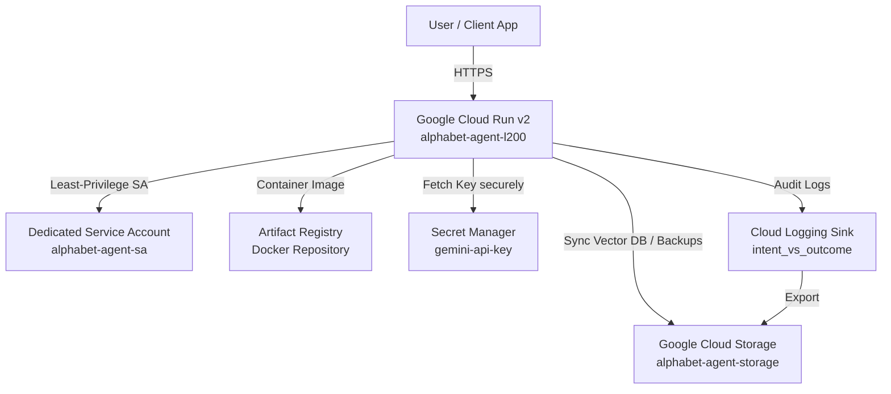

# Infrastructure as Code (IaC) for Alphabet Financial Agent (L200)

This directory contains production-ready Terraform configurations to provision and manage the cloud infrastructure for the **Alphabet Inc. (`GOOG`/`GOOGL`) Financial Intelligence Agent** on Google Cloud Platform.

---

## Architecture Overview



---

## Provisioned GCP Resources

1. **Google Cloud Run (v2 Service)**:
   - Houses the containerized ADK agent app with FastAPI `/dev-ui` and A2A `/a2a/app` endpoints.
   - Configured with strategic model routing environment variables (`COORDINATOR_MODEL`, `NEWS_MODEL`, `METRICS_MODEL`, `SUMMARIZER_MODEL`).
   - TCP startup and liveness health probes.
   - Concurrency limits and autoscaling controls (configurable min/max instances).
2. **Google Artifact Registry**:
   - Private, regional Docker repository for container images.
3. **Google Secret Manager**:
   - Stores `gemini-api-key` securely, mounted directly into Cloud Run container environment without plain text leakage.
4. **Google Cloud Storage (GCS)**:
   - Dedicated bucket with uniform bucket-level access and versioning for persistent SQLite vector memory backups and agent artifacts.
5. **Least-Privilege IAM & Service Account**:
   - `roles/secretmanager.secretAccessor` (access Gemini API key)
   - `roles/storage.objectUser` (read/write persistent memory & artifacts)
   - `roles/logging.logWriter` (write structured JSON logs)
   - `roles/cloudtrace.agent` (emit OpenTelemetry traces)
   - `roles/aiplatform.user` (Vertex AI access if needed)
6. **Cloud Logging Project Sink**:
   - Automatically captures structured `intent_vs_outcome` auditing events and exports them to storage for compliance and analytics.

---

## Quickstart Deployment Guide

### Prerequisites
1. [Google Cloud SDK (`gcloud`)](https://cloud.google.com/sdk/docs/install) installed and authenticated:
   ```bash
   gcloud auth login
   gcloud auth application-default login
   ```
2. [Terraform CLI](https://developer.hashicorp.com/terraform/downloads) (>= 1.5.0) installed.

### Step 1: Configure Variables
Copy the example variables file and set your target GCP project:
```bash
cp terraform.tfvars.example terraform.tfvars
```
Edit `terraform.tfvars`:
```hcl
project_id   = "your-gcp-project-id"
region       = "us-central1"
service_name = "alphabet-agent-l200"
```

### Step 2: Initialize & Apply Infrastructure
```bash
terraform init
terraform plan
terraform apply
```

### Step 3: Populate the Secret Key
Store your Gemini API key in the provisioned Secret Manager secret:
```bash
echo -n "YOUR_GEMINI_API_KEY" | gcloud secrets versions add gemini-api-key --data-file=- --project="your-gcp-project-id"
```

### Step 4: Build and Push Container Image
Authenticate Docker to your provisioned Artifact Registry:
```bash
gcloud auth configure-docker us-central1-docker.pkg.dev
```

Build and push the agent image:
```bash
IMAGE_URI="us-central1-docker.pkg.dev/your-gcp-project-id/alphabet-agent-l200-repo/alphabet-agent-l200:latest"

docker build -t $IMAGE_URI .
docker push $IMAGE_URI
```

### Step 5: Update Cloud Run Revision
```bash
gcloud run deploy alphabet-agent-l200 \
  --image=$IMAGE_URI \
  --region=us-central1 \
  --project="your-gcp-project-id"
```
